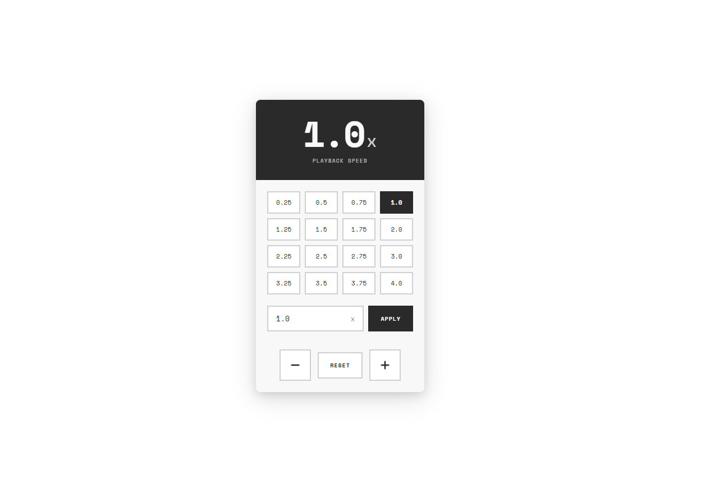
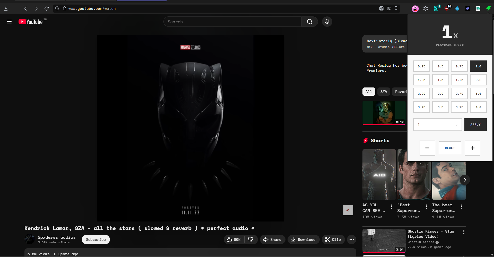
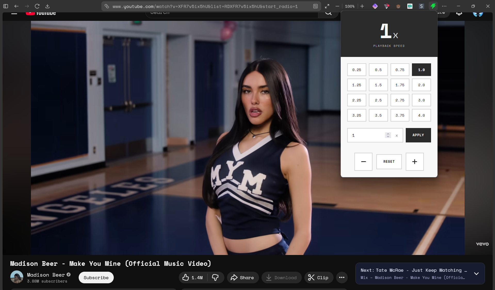

# YouTube Speed Controller Extension

A browser extension that allows you to easily control YouTube video playback speed with a beautiful, user-friendly interface. Available for both Chrome and Firefox.



## Features

- **Preset Speed Buttons**: Quick access to common speeds (0.25x, 0.5x, 0.75x, 1.0x, 1.25x, 1.5x, 1.75x, 2.0x, and more up to 4.0x)
- **Custom Speed Input**: Set any speed between 0.25x and 4x
- **Increase/Decrease Buttons**: Fine-tune speed in 0.25x increments
- **Speed Persistence**: Your speed preference is remembered across videos
- **Modern UI**: Clean black and white design with Space Mono font

## Screenshots

### Chrome Extension


### Firefox Extension


## Installation

### For Chrome

1. **Download or Clone** this repository to your computer

2. **Open Chrome Extensions Page**:
   - Open Google Chrome
   - Navigate to `chrome://extensions/`
   - Or go to Menu (three dots) → More tools → Extensions

3. **Enable Developer Mode**:
   - Toggle the "Developer mode" switch in the top right corner

4. **Load the Extension**:
   - Click "Load unpacked"
   - Select the `chrome` folder from this repository
   - The extension should now appear in your extensions list

### For Firefox

1. **Download or Clone** this repository to your computer

2. **Open Firefox Add-ons Page**:
   - Open Mozilla Firefox
   - Navigate to `about:debugging`
   - Click "This Firefox" in the left sidebar

3. **Load the Extension**:
   - Click "Load Temporary Add-on..."
   - Navigate to the `firefox` folder and select the `manifest.json` file
   - The extension should now appear in your add-ons list

## Usage

1. Navigate to any YouTube video page
2. Click the extension icon in your browser toolbar (Chrome or Firefox)
3. Select a preset speed from the grid or enter a custom speed in the input field
4. Click "apply" or use the increase/decrease buttons to adjust speed
5. The video playback speed will update immediately
6. Your speed preference is saved and will persist across videos

## Keyboard Shortcuts

- Use the `+` and `-` buttons in the popup to adjust speed in 0.25x increments
- Press Enter in the custom speed input to apply the speed

## Speed Range

- Minimum: 0.25x (quarter speed)
- Maximum: 4x (four times speed)
- Default: 1.0x (normal speed)

## Files Structure

```
youtube-speed-controller/
├── chrome/                    # Chrome extension files
│   ├── manifest.json          # Extension configuration
│   ├── popup.html             # Popup UI structure
│   ├── popup.css              # Popup styling
│   ├── popup.js               # Popup functionality
│   ├── content.js             # Content script for YouTube pages
│   └── icons/
│       └── icon.png           # Extension icon
├── firefox/                   # Firefox extension files
│   ├── manifest.json          # Extension configuration
│   ├── popup.html             # Popup UI structure
│   ├── popup.css              # Popup styling
│   ├── popup.js               # Popup functionality
│   ├── content.js             # Content script for YouTube pages
│   └── icons/
│       └── icon.png           # Extension icon
├── chrome.png                 # Chrome extension screenshot
├── firefox.png                # Firefox extension screenshot
├── image.png                  # Extension UI mockup
└── README.md                  # This file
```

## Permissions

This extension requires minimal permissions:
- `activeTab`: To interact with the current YouTube tab
- `scripting`: To inject scripts that control video playback
- `https://www.youtube.com/*`: To access YouTube pages

The extension only runs on YouTube pages and doesn't collect any personal data.

## Troubleshooting

- **Extension not working?**: Make sure you're on a YouTube video page (youtube.com/watch)
- **Speed not persisting?**: Refresh the page after setting the speed
- **Popup not opening?**: Check that the extension is enabled in chrome://extensions/

## License

This project is open source and available for personal and commercial use.

## Contributing

Feel free to submit issues, fork the repository, and create pull requests for any improvements.
